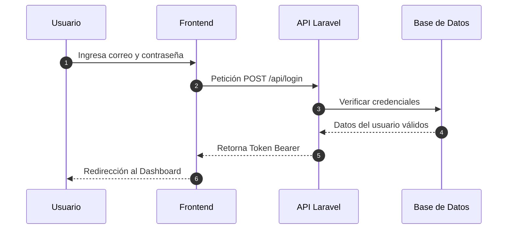

# Guía Paso a Paso: Cómo usar Markdown en tu Documentación

En esta página aprenderás **de forma muy sencilla y paso a paso** cómo usar todos los trucos y componentes visuales de VitePress para que tu documentación se vea increíble. 

Cada sección incluye el **código que debes copiar y pegar** y el **resultado visual** de cómo se verá.

---

## 1. Crear Pestañas de Código (Code Groups)

Esta herramienta sirve para mostrar varios códigos en un mismo cuadro con pestañas para cambiar entre ellos (por ejemplo, para mostrar archivos diferentes de Laravel o comandos).

### ✍️ Lo que debes escribir en tu archivo `.md`:

````md
::: code-group

```php [Rutas: routes/web.php]
Route::get('/pokemon', [PokemonController::class, 'index']);
```

```bash [Comandos Terminal]
php artisan serve
```

:::
````

### 👁️ Resultado final:

::: code-group

```php [Rutas: routes/web.php]
Route::get('/pokemon', [PokemonController::class, 'index']);
```

```bash [Comandos Terminal]
php artisan serve
```

:::

---

## 2. Cajas de Alertas de Colores (Callouts)

Sirven para poner mensajes destacados que llamen la atención del lector con un cuadro de color.

### ✍️ Lo que debes escribir:

```md
::: tip CONSEJO
Este es un consejo útil.
:::

::: info NOTA
Esta es una información importante.
:::

::: warning ADVERTENCIA
Ten cuidado con este paso.
:::

::: danger PELIGRO
No borres este archivo o el sistema fallará.
:::
```

### 👁️ Resultado final:

::: tip CONSEJO
Este es un consejo útil.
:::

::: info NOTA
Esta es una información importante.
:::

::: warning ADVERTENCIA
Ten cuidado con este paso.
:::

::: danger PELIGRO
No borres este archivo o el sistema fallará.
:::

---

## 3. Etiquetas de Colores (Badges)

Son pequeñas etiquetas de texto con fondo de color que puedes colocar en cualquier párrafo o título para marcar versiones o estados.

### ✍️ Lo que debes escribir:

```md
* Estado del módulo: <Badge type="tip" text="Completado" />
* Versión actual: <Badge type="info" text="v1.0.0" />
* Módulo en pruebas: <Badge type="warning" text="En revisión" />
* Función obsoleta: <Badge type="danger" text="Eliminado" />
```

### 👁️ Resultado final:

* Estado del módulo: <Badge type="tip" text="Completado" />
* Versión actual: <Badge type="info" text="v1.0.0" />
* Módulo en pruebas: <Badge type="warning" text="En revisión" />
* Función obsoleta: <Badge type="danger" text="Eliminado" />

---

## 4. Resaltar Líneas de Código y Mostrar Números

Puedes decirle al sistema que marque líneas específicas de código para que el lector se enfoque en ellas.

### ✍️ Lo que debes escribir:
*(Agrega `{3}` al lado del lenguaje para resaltar la línea 3, y `:line-numbers` para ver los números de línea).*

````md
```php{3}:line-numbers
namespace App\Services;

// Esta línea 3 aparecerá resaltada de color verde
$pokemon = Pokemon::create($datos);
return $pokemon;
```
````

### 👁️ Resultado final:

```php{3}:line-numbers
namespace App\Services;

// Esta línea 3 aparecerá resaltada de color verde
$pokemon = Pokemon::create($datos);
return $pokemon;
```

---

## 5. Mostrar Cambios de Código (Líneas Verdes y Rojas)

Usa la palabra `diff` al inicio del bloque de código. Coloca un signo `+` para lo que agregaste y un signo `-` para lo que eliminaste.

### ✍️ Lo que debes escribir:

````md
```diff
- Route::get('/old-route', [OldController::class, 'index']);
+ Route::get('/new-route', [NewController::class, 'index']);
```
````

### 👁️ Resultado final:

```diff
- Route::get('/old-route', [OldController::class, 'index']);
+ Route::get('/new-route', [NewController::class, 'index']);
```

---

## 6. Bloque Desplegable / Oculto (Acordeón)

Ideal para ocultar explicaciones largas o respuestas para que el lector haga clic y las abra solo si desea verlas.

### ✍️ Lo que debes escribir:

```md
::: details Clic aquí para ver la solución
Aquí escribes el texto o código que estará oculto hasta que la persona haga clic.
:::
```

### 👁️ Resultado final:

::: details Clic aquí para ver la solución
Aquí escribes el texto o código que estará oculto hasta que la persona haga clic.
:::

---

## 7. Listas de Tareas Pendientes (Checklist)

Sirve para mostrar listas con casillas marcadas o desmarcadas.

### ✍️ Lo que debes escribir:

```md
- [x] Tarea ya terminada (usa una "x" minúscula)
- [ ] Tarea pendiente (deja un espacio dentro de los corchetes)
```

### 👁️ Resultado final:

- [x] Tarea ya terminada (usa una "x" minúscula)
- [ ] Tarea pendiente (deja un espacio dentro de los corchetes)

---

## 8. Crear Tablas de Información

Ideal para listas de datos o documentación de rutas API.

### ✍️ Lo que debes escribir:

```md
| Método | Ruta | Estado |
| :--- | :--- | :---: |
| `GET` | `/api/v1/pokemon` | <Badge type="tip" text="Activo" /> |
| `POST` | `/api/v1/pokemon` | <Badge type="warning" text="Pruebas" /> |
```

### 👁️ Resultado final:

| Método | Ruta | Estado |
| :--- | :--- | :---: |
| `GET` | `/api/v1/pokemon` | <Badge type="tip" text="Activo" /> |
| `POST` | `/api/v1/pokemon` | <Badge type="warning" text="Pruebas" /> |

---

## 9. Crear Diagramas de Flujo Interactivos (Mermaid)

Para dibujar diagramas de secuencia, procesos o flujos de datos sin necesidad de subir imágenes externas, utiliza la palabra `mermaid` en el bloque de código.

### ✍️ Lo que debes escribir:

````md

````

### 👁️ Resultado final:


---

## 10. Insertar Imágenes con Zoom Interactivo

Para agregar capturas de pantalla, diagramas o ilustraciones a tu documentación, puedes guardar tus archivos de imagen en la carpeta `public/` (por ejemplo en `docs/public/images/`).

### ✍️ Lo que debes escribir:

```md

```

> 💡 **Zoom Interactivo Automático:** Todas las imágenes agregadas en los documentos cuentan con soporte de zoom interactivo. Al hacer clic sobre cualquier imagen en la documentación, se ampliará suavemente a pantalla completa.

